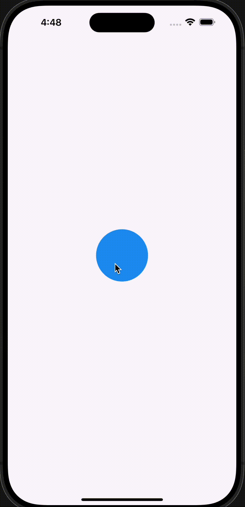
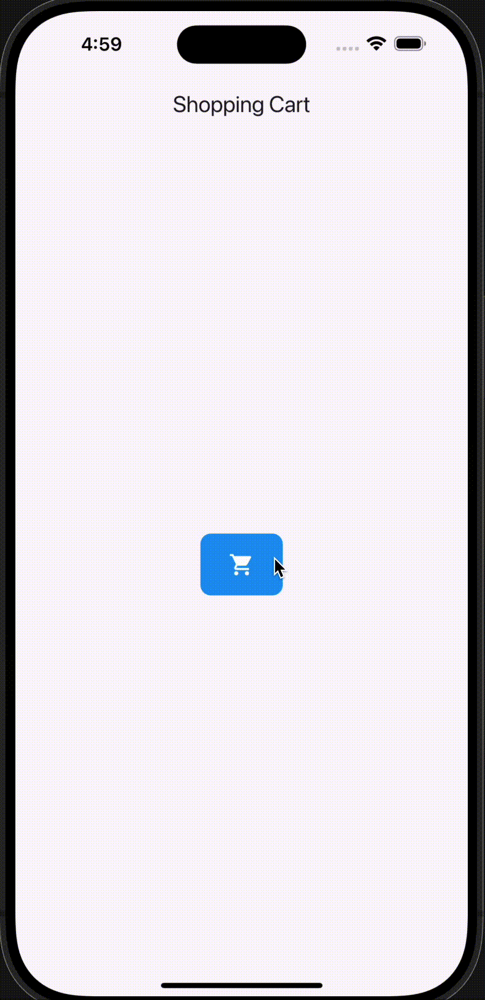
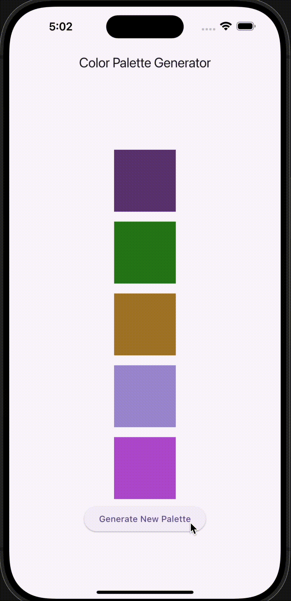
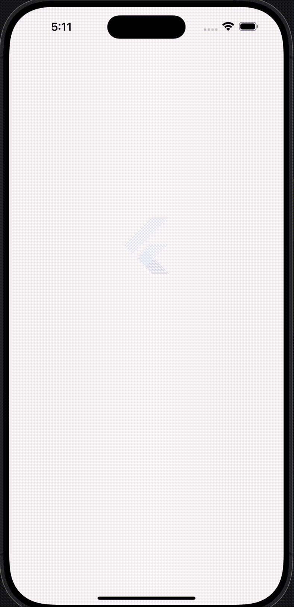
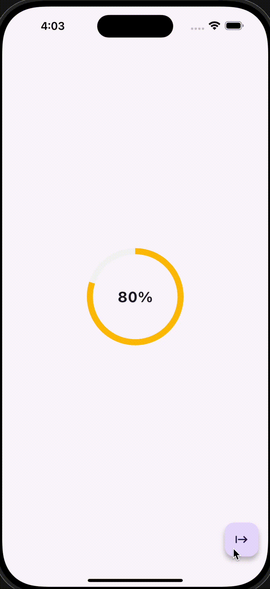
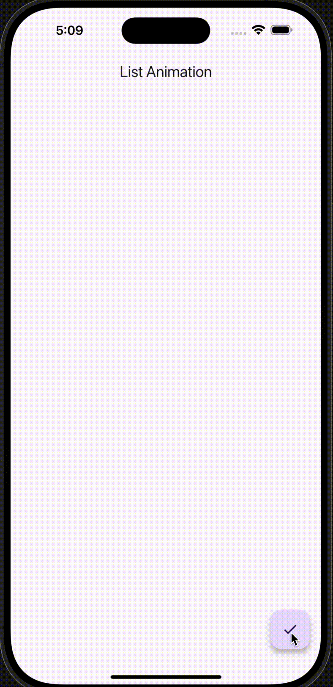

# Flutter Animation Showcase

This project demonstrates various Flutter animations, including implicit and explicit animations, page route animations, and custom UI interactions. Each animation is illustrated with a unique GIF for better visualization.

## Animations Included

1. **Splash Animation** - A scale transition that animates a circle and transitions to a new screen.
2. **Pulsating Circle Animation** - A circle that pulsates in size, with a text label in the center.
3. **Shopping Cart Button Animation** - A button that expands and changes its appearance when tapped.
4. **Animated Color Palette** - A set of animated color boxes that change color.
5. **Login Screen Animation** - A screen with fading, sliding, and scaling transitions for logo and form fields.
6. **Radial Progress Animation** - A circular progress bar that animates based on the progress value.
7. **List Animation** - A list of items that slide into view one by one.

## Animations

### 1. **Splash Animation**
A circle starts small and expands on tap. Once fully expanded, it transitions to a new screen using a fade transition.

  

### 2. **Pulsating Circle Animation**
A circle pulsates in size while displaying a label in the center. The animation duration is set to 5 seconds.

  

### 3. **Shopping Cart Button Animation**
This animation showcases a shopping cart button that expands and shrinks upon tap, with color and icon transitions.

  

### 4. **Animated Color Palette**
A set of color boxes that animate their color transition. Tap the button to regenerate a new color palette.

  

### 5. **Login Screen Animation**
The login screen features a logo that fades in and a form that slides up and scales into place when the animation is triggered.

  

### 6. **Radial Progress Animation**
A radial progress bar animates to show the percentage of completion. The progress is updated when the user taps the floating action button.

  

### 7. **List Animation**
A list of items slides into view one by one, creating a smooth transition as each item appears.

  

